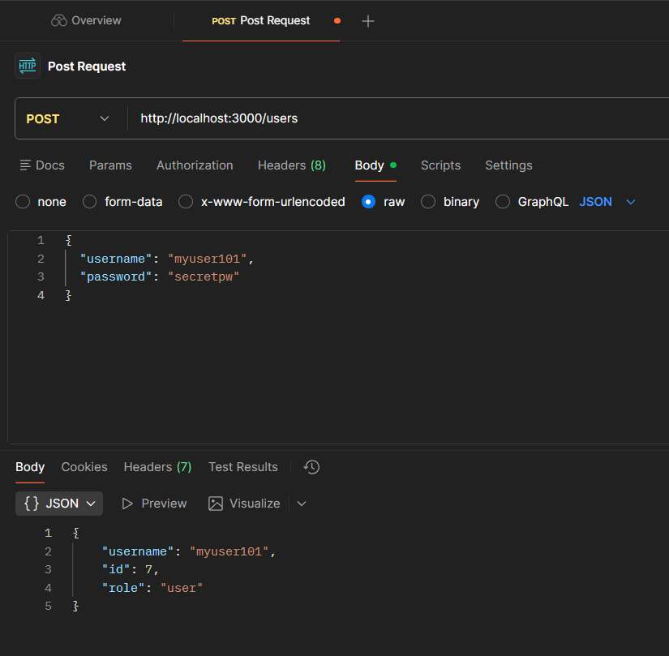
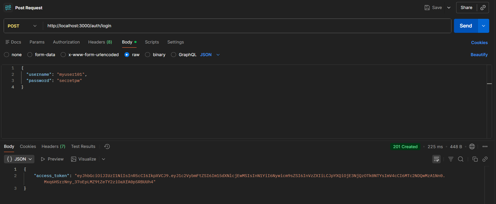
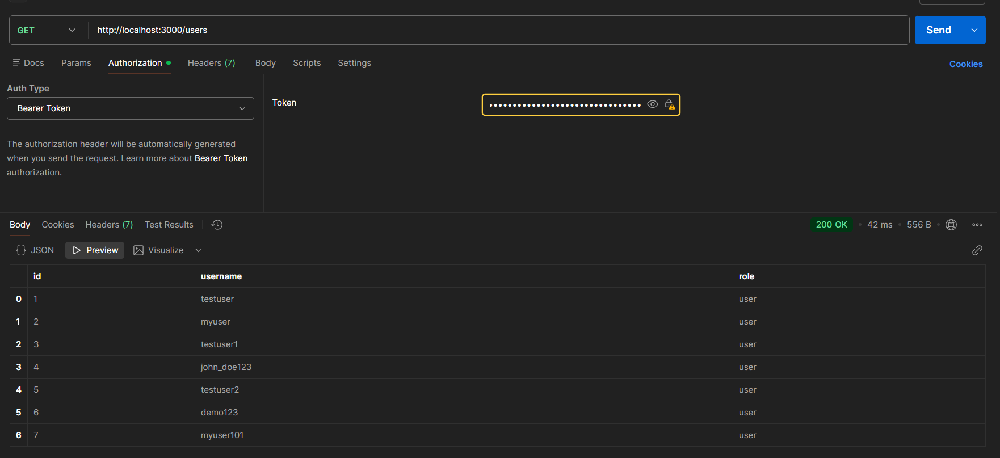
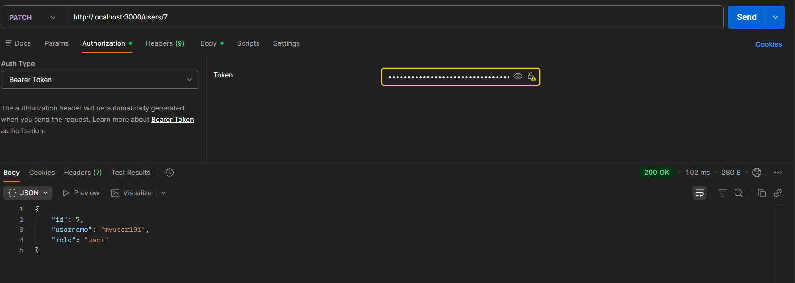
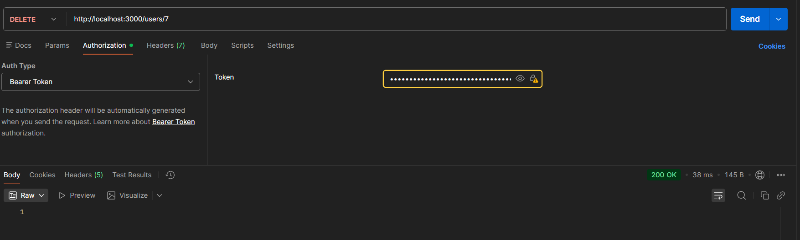
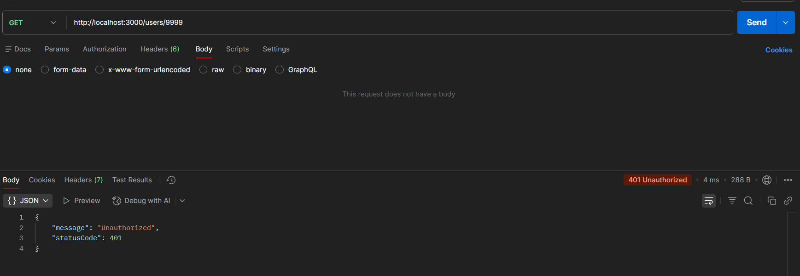
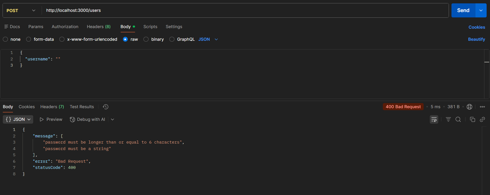

# NestJS Backend Assignment

## Features

- User CRUD API with PostgreSQL & TypeORM
- JWT-based authentication & authorization
- Input validation, meaningful error handling
- Automated unit tests with Jest
- Well-organized, documented codebase

---

## Getting Started

### Prerequisites

- Node.js 16+
- PostgreSQL running (database named `nestdb`)

### Install

```bash
git clone https://github.com/Bellamkonda-Nokesh/nest-backend-assignment.git
cd nest-backend-assignment
npm install
```

### Configure Environment

Copy `.env.example` to `.env` and fill in your DB credentials:

```env
DB_HOST=localhost
DB_PORT=5432
DB_USERNAME=postgres
DB_PASSWORD=yourpassword
DB_DATABASE=nestdb
JWT_SECRET=changeme
```

---

### Run the App

```bash
npm run start:dev
```
_App will be available on http://localhost:3000_

---

## API Endpoints

### Register User
- **POST** `/users`
- **Body:**
  ```json
  { "username": "demo123", "password": "password123" }
  ```

### Login
- **POST** `/auth/login`
- **Body:**
  ```json
  { "username": "demo123", "password": "password123" }
  ```
- **Response:**  
  `{ "access_token": "..." }`

### List Users (Protected)
- **GET** `/users`
- **Authorization:** Bearer token required

### Other endpoints:
- **GET** `/users/:id`
- **PATCH** `/users/:id`
- **DELETE** `/users/:id`

---

## Example Postman Requests & Responses

- **Register:**  
  
  - *Demonstrates submitting a POST request to `/users` with a username and password to register a new user. The response confirms creation with the user's ID, username, and role.*

- **Login and JWT:**  
  
  - *Shows a POST request to `/auth/login` with username and password. The response provides a JWT (`access_token`) needed for accessing protected endpoints.*

- **List Users:**  
  
  - *Shows a GET request to `/users` with a valid Bearer Token. The response lists all registered users and their roles, proving token-based access control is implemented.*

- **Update User:**  
  
  - *Displays a PATCH request to `/users/7` with Bearer Token auth to update user info. The response returns the updated user data after changes.*

- **Delete User:**  
  
  - *Shows a DELETE request to `/users/7` with a valid Bearer Token. The response (`1`) confirms the user was successfully deleted.*

- **Unauthorized Error:**  
  
  - *Shows a GET request to `/users/9999` without a Bearer Token. The response is a 401 Unauthorized error, demonstrating that protected routes cannot be accessed without authentication.*

- **Update User:**  
  
  - *Shows a PATCH request to `/users/7` with Bearer Token authentication. The response returns the updated user details, confirming the update operation worked.*

- **Validation Error:**  
  
  - *Displays a POST request to `/users` with an invalid (empty) username and missing password. The response is a 400 Bad Request error with validation messages, proving input validation is enforced by the API.*

> 👉 **Full Test/Output Record:**  
> For a detailed demo with all outputs (screenshots/video), see: [Assignment Proof Outputs](https://drive.google.com/file/d/1BbRWADxY9RF2IveNskdH1Vmg8r-V07DP/view?usp=sharing)  
> _Or, upload your compiled screenshots/video to a cloud drive, then place the **shared link here** for your mentor to review._

---

## Authentication (How it works)

- After registering, log in via `/auth/login` to receive a JWT.
- For all protected routes (like `/users`), add this JWT as a Bearer Token, e.g.,
  ```
  Authorization: Bearer <access_token>
  ```
- If a request is made to a protected route **without** a valid token, you’ll receive a 401 Unauthorized error.

---

## Running Unit Tests

```bash
npm run test
```
- All basic and additional tests should pass, showing your API functions are verified.

---

## Project Structure

```
src/
  app.module.ts
  auth/
    auth.controller.ts
    auth.module.ts
    auth.service.ts
    jwt-auth.guard.ts
    jwt.strategy.ts
  users/
    dto/
    user.entity.ts
    users.controller.ts
    users.module.ts
    users.service.ts
    users.service.spec.ts
  main.ts
test/
  users.service.spec.ts
.env
package.json
README.md
tsconfig.json
```

---

## Code Documentation & Comments

- **DTOs/classes** use decorators like `@IsString()` and `@IsNotEmpty()` for validation and clarity.
- **All major functions and classes** are documented with JSDoc comments.  
  Example:
  ```typescript
  /**
   * Validates a user based on JWT payload.
   * @param payload The decoded JWT payload.
   */
  async validate(payload: any) { ... }
  ```
- **Inline comments** are provided for complex logic.  
  _See source files for code-level documentation._

---

## Author

Bellamkonda Nokesh

---

## **Contact / Proofs**

- [GitHub Repo](https://github.com/Bellamkonda-Nokesh/nest-backend-assignment)
- [Assignment Proof Outputs (screenshots/video)](https://drive.google.com/file/d/1BbRWADxY9RF2IveNskdH1Vmg8r-V07DP/view?usp=sharing)  

---

**_Thank you for reviewing!_**
